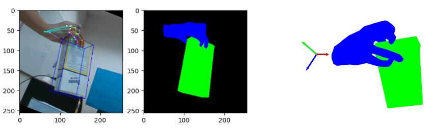

# HANDS22 Challenge Task 2: RGB-Based 3D Interacting Object Pose Estimation
This repository contains scripts relating to the Task 2 of [HANDS2022 challenge](https://sites.google.com/view/hands2022/call-for-extended-abstract?authuser=0) organized
at ECCV'22. 

The goal of this task is to estimate the pose of hand-held objects from a single RGB image.
For more details:
* HANDS22 website: 
* Challenge Website:
* Dataset Download:

The dataset used in the challenge is a refactored version of HO-3D dataset. We provide scripts for the following
in this repo:
* Dataset Visualization Script.
* Challenge Submission Script.
* Object Pose Accuracy Evaluation Script.

## Installation

1. Download MANO model files from the [website](https://mano.is.tue.mpg.de/) (requires login) to `smplx_dir`
2. Download the dataset to `dataset_dir`.
3. Download the YCB object models by clicking on `The YCB-Video 3D Models` [here](https://rse-lab.cs.washington.edu/projects/posecnn/]). Save
the models in `object_models_dir`
4. Install the required modules:
```
pip install open3d matplotlib argparse opencv-python torch smplx pillow
```

## Dataset Visualization

To visualize the annotations in the train set, run the following:
```python
python vis.py --dataset_dir dataset_dir --smplx_path smplx_dir --object_models_dir object_models_dir
```
The annotations in 2D and segmentation map are shown in a matplotlib window and the mesh is visualized
in an open3d window.


## Challenge Submission

To submit your results to the challenge for automatic evaluation modify `challenge_submit.py` to call your
function and dump the json file. The json file has to **zipped** before submission. 

```python
python challenge_submit.py --dataset_dir dataset_dir
```
## Object Pose Evaluation

We use Maximum Symmetry-aware Surface Distance (MSSD) metric to measure the accuracy of the object pose estimates. Refer to the 
[challenge website]() for more description of the metric. The script `evaluation.py` is used in the 
codalab competition server for evaluating the submissions. The annotations of the test set are withheld.